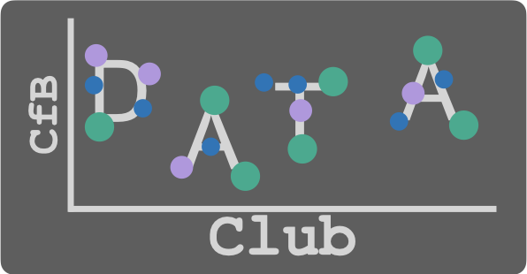

  

# DTU Biosustain Data Club

A forum for researchers of all levels to discuss, learn, explore and analyse data.

You will find:
- Data and data science releated presentations
- Code to explore, analyse and mine data
- Relevant links to data-related topics

## Goals of the Club

—> Foster a community

—> Create a forum for discussion and solving questions

—> Find the right people to help

—> Learn from each other and share knowledge about data

## Building a Data Culture

- Data and data science as a unifying factor across research disciplines

- Align on the importance of data and the processes to manage and the methods to analyse them

- Provide the support to acquire the skills and knowledge to access, read, understand, and communicate data effectively

- Focusing on collaboration by sharing data across teams and departments

- Use of data as a means to improve and innovate

## Topics

Data literacy – what is it? (March)

Data wrangling (May) -- 
  - [Notebooks](https://github.com/biosustain/data_club/tree/main/notebooks/data_wrangling)
  - [Slides](https://github.com/biosustain/data_club/blob/main/slides/2_data_wrangling.pdf)

Data visualization (July/August) --
- [Notebooks](https://github.com/biosustain/data_club/tree/main/notebooks/visualisation_with_matplotlib)

Tools (September)

Making use of publicly available data and databases (November)

Analytics for understanding and predicting (December)

## Organisers

Alberto Santos -- albsad@biosustain.dtu.dk

Teddy Groves -- tedgro@biosustain.dtu.dk

CfB Partnerships & Research Office (PRO) -- Sünje Johanna Pamp -- sjpa@biosustain.dtu.dk
